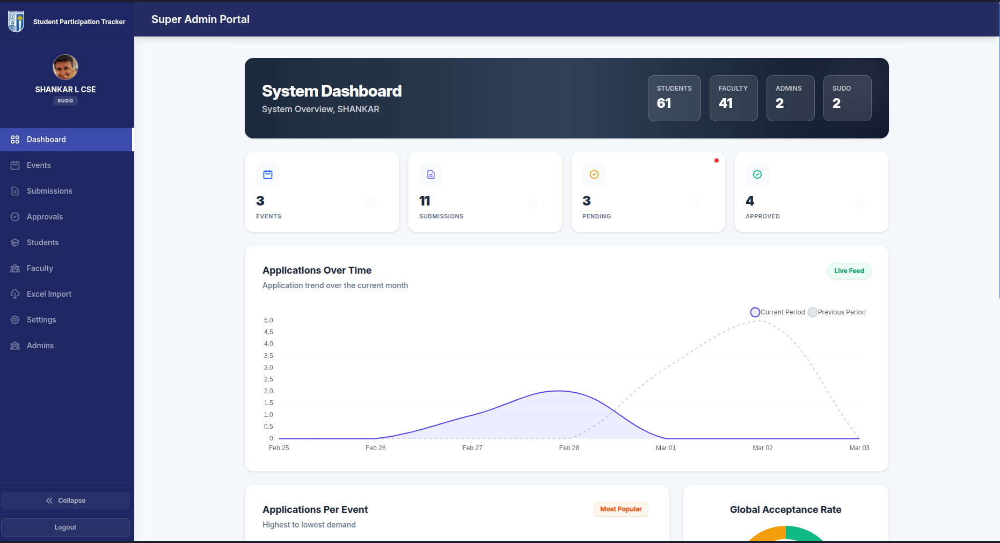
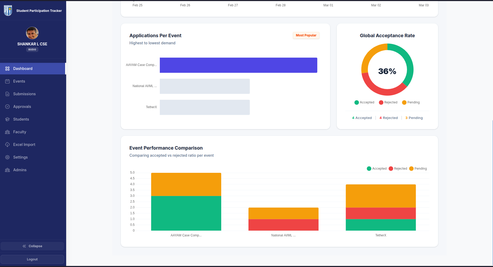
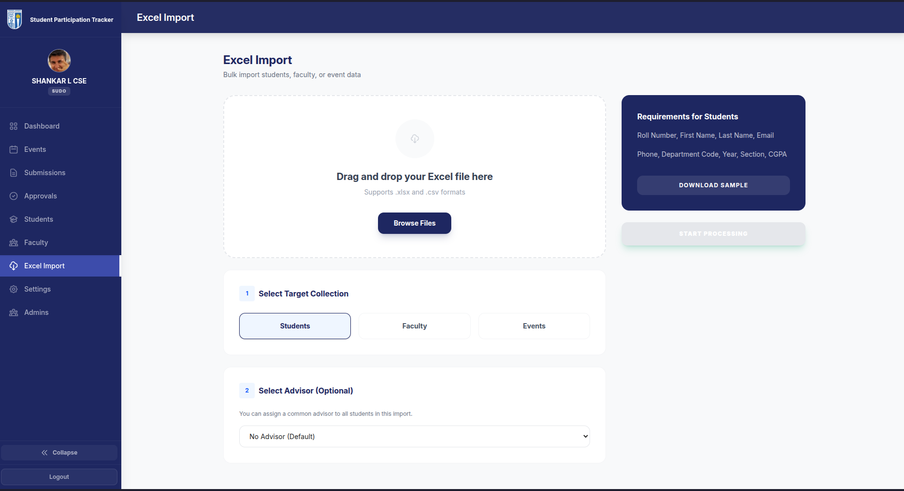
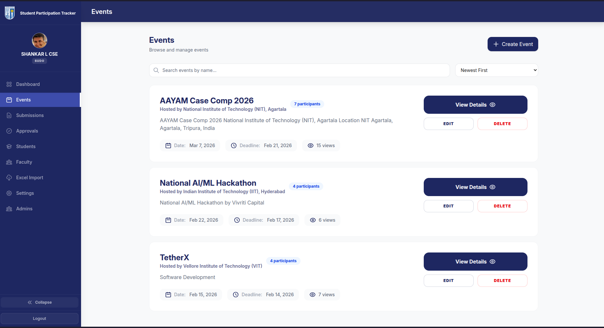
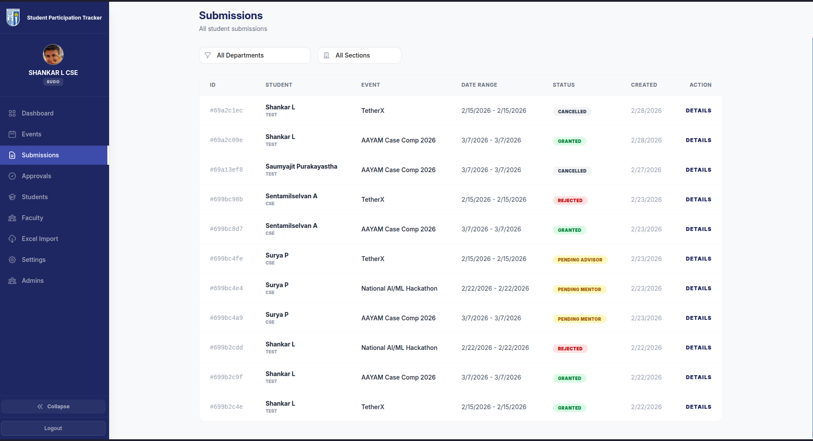

<p align="center">
  
</p>

# 🎓 SECE Student Participation Tracking System (SPTS)

[](https://nextjs.org/)
[](https://appwrite.io/)
[](https://tailwindcss.com/)

The **SECE Student Participation Tracking System (SPTS)** is a comprehensive web application designed to monitor, manage, and streamline student participation in inter-college activities and events outside of **Sri Eshwar College of Engineering (SECE)**.

It provides a robust platform for students to request **On Duty (OD)** permissions and for faculty members to manage approvals through a structured, multi-level hierarchy.

---

## 📸 Screenshots

<p align="center">
  
</p>
<p align="center">
  
  
</p>
<p align="center">
  
  
</p>

---

## ✨ Key Features

- **🚀 Multi-level OD Approval Workflow**: Automated approval process involving Mentors, Class Advisors, Year Coordinators, and HODs.
- **📊 Interactive Dashboards**: Role-based dashboards (Admin, Faculty, Student) with real-time analytics using Chart.js.
- **📅 Event Management**: Create, track, and manage various inter-college events and student participations.
- **📁 Data Management**: Bulk import student and faculty data via Excel sheets.
- **🔒 Secure Authentication**: Robust user authentication and role-based access control (RBAC) powered by Appwrite.
- **📱 Responsive Design**: Fully responsive UI built with Tailwind CSS for seamless access across devices.

---

## 🛠️ Tech Stack

- **Frontend**: [Next.js](https://nextjs.org/) (React Framework)
- **Styling**: [Tailwind CSS](https://tailwindcss.com/)
- **Backend & Database**: [Appwrite](https://appwrite.io/) (Auth, Database, Storage)
- **Charts**: [Chart.js](https://www.chartjs.org/)
- **Excel Processing**: [SheetJS (XLSX)](https://sheetjs.com/)

---

## 🚀 Getting Started

### Prerequisites

- [Node.js](https://nodejs.org/) (v18 or later)
- [npm](https://www.npmjs.com/) or [yarn](https://yarnpkg.com/)
- An [Appwrite](https://appwrite.io/) instance (Cloud or Self-hosted)

### Installation

1. **Clone the repository**:
   ```bash
   git clone https://github.com/cephalic-labs/spts.git
   cd spts
   ```

2. **Install dependencies**:
   ```bash
   npm install
   ```

3. **Configure Environment Variables**:
   Create a `.env` file in the root directory and add your Appwrite credentials:
   ```env
   NEXT_PUBLIC_APPWRITE_PROJECT_ID=your_project_id
   NEXT_PUBLIC_APPWRITE_ENDPOINT=your_endpoint
   APPWRITE_API_KEY=your_api_key
   NEXT_PUBLIC_APP_URL=http://localhost:3000
   ```
   
   ⚠️ **Security Note**: `APPWRITE_API_KEY` is server-only and will NOT be exposed to the client.
   
   📝 **Production Note**: Set `NEXT_PUBLIC_APP_URL` to your production domain (e.g., `https://spts.sece.ac.in`) for OAuth callbacks and email links.

4. **Run the development server**:
   ```bash
   npm run dev
   ```

Open [http://localhost:3000](http://localhost:3000) with your browser to see the result.

---

## 📂 Project Structure

```text
src/
├── app/            # Next.js App Router (Routes & Pages)
├── components/     # Reusable React components
│   ├── dashboards/ # Role-specific dashboard views
│   ├── pages/      # Feature-specific page contents
│   └── ui/         # Base UI components
├── lib/            # Utilities, Services, and Configurations
│   ├── services/   # Business logic & Appwrite API calls
│   └── dbConfig.js # Database schema & Workflow rules
└── static/         # Static assets and images
```

---

## 📖 Documentation

Detailed technical documentation, including system architecture, database schema, and approval workflows, can be found in the [TECHNICAL_DOCS.md](TECHNICAL_DOCS.md) file.

---

## 🤝 Project Maintainers

#### Built With ❤️ by [Cephalic Labs](https://github.com/cephalic-labs):
- [Saumyajit Purakayastha](https://github.com/agspades)
- [Shankar L](https://github.com/Shankar-CSE)

---

