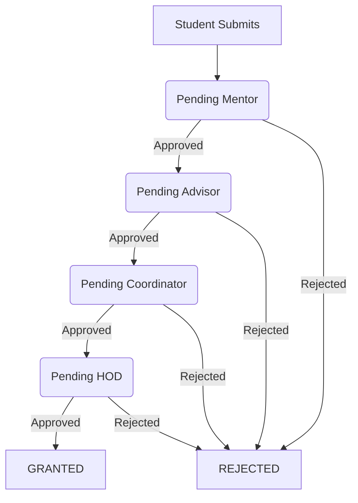

# 🛠️ Technical Documentation - SPTS

This document provides a detailed technical overview of the **SECE Student Participation Tracking System (SPTS)**.

---

## 🏗️ System Architecture

The application is built using a modern full-stack architecture with **Next.js** on the frontend and **Appwrite** as the Backend-as-a-Service (BaaS).

### Frontend Structure

- **Next.js App Router**: Handles routing and server-side rendering where applicable.
- **Context API**: `AuthContext` manages user sessions and authentication state globally.
- **Modular Components**: Page-specific logic is abstracted into `src/components/pages`, while shared UI elements are in `src/components/ui`.
- **Services Layer**: `src/lib/services` contains decoupled logic for interacting with Appwrite APIs.

### Backend (Appwrite)

- **Authentication**: Email/Password based authentication.
- **Database**: NoSQL-like collections for storing students, faculty, events, and OD requests.
- **Access Control**: Role-based access control (RBAC) enforced via frontend guards and potentially Appwrite permissions.

---

## 🗄️ Database Schema

The system uses the following collections in Appwrite (Database: `sece-spts-db`):

| Collection ID    | Description               | Key Fields                                            |
| :--------------- | :------------------------ | :---------------------------------------------------- |
| `users`          | Core user accounts        | `email`, `name`, `role`, `status`                     |
| `sece-students`  | Detailed student profiles | `rollNo`, `dept`, `batch`, `mentorId`                 |
| `sece-faculties` | Faculty profiles          | `facultyId`, `name`, `dept`, `role`                   |
| `events`         | Inter-college events      | `name`, `date`, `venue`, `organizer`                  |
| `od-requests`    | Student OD applications   | `studentId`, `eventId`, `status`, `reason`            |
| `approval_logs`  | Audit trail for approvals | `requestId`, `actorId`, `action`, `timestamp`         |
| `nirf_list`      | Managed NIRF colleges     | `college_name`, `rank`                                |
| `od_quota`       | Editable OD policy        | `iit_nit`, `university`, `nirf`, `industry`, `others` |

> [!NOTE]
> All collection IDs and workflow constants are centralized in `src/lib/dbConfig.js`.

---

## 🚦 OD Approval Workflow

The core of the system is a 4-stage approval workflow for On Duty (OD) requests.

### Approval Stages

1. **Pending Mentor**: Initial stage after student submission.
2. **Pending Advisor**: After Mentor approval.
3. **Pending Coordinator**: After Class Advisor approval.
4. **Pending HOD**: Final stage before being "Granted".

### Workflow Logic

The state transitions are managed by the `getNextStatus()` utility in `src/lib/dbConfig.js`:



---

## 🔑 Roles & Permissions

- **Student**: Can submit OD requests, view status, and participate in events.
- **Mentor**: Approves/Rejects ODs for their assigned students.
- **Advisor**: Manages ODs for a specific class/batch.
- **Coordinator**: Oversees ODs for an entire year level in a department.
- **HOD**: Final authority for OD approvals within the department.
- **Admin**: Full system access (Manage Users, Bulk Imports, Settings).

---

## 📦 Deployment

### Build

To create a production build of the application:

```bash
npm run build
```

### Environment Variables

Ensure the following variables are set in your production environment:

- `NEXT_PUBLIC_APPWRITE_PROJECT_ID`
- `NEXT_PUBLIC_APPWRITE_ENDPOINT`
- `NEXT_PUBLIC_APPWRITE_API_KEY`

---

## 🛠️ Maintenance & Development

- **Formatting**: The project uses Prettier and ESLint. Run `npm run lint` before committing.
- **Styling**: Tailwind CSS configuration is located in `postcss.config.mjs` and the global styles are in `src/app/app.css`.
- **Database Changes**: Update `src/lib/dbConfig.js` when modifying collection IDs or workflow states.
- **Managed Quotas**: OD quota values are now stored in the `od_quota` collection and reset actions should read from that policy instead of hard-coded values.
- **NIRF Colleges**: The searchable NIRF college dropdown is backed by the `nirf_list` collection and managed from the admin settings page.
